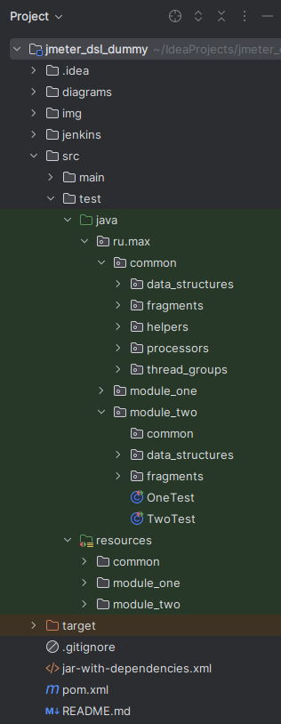
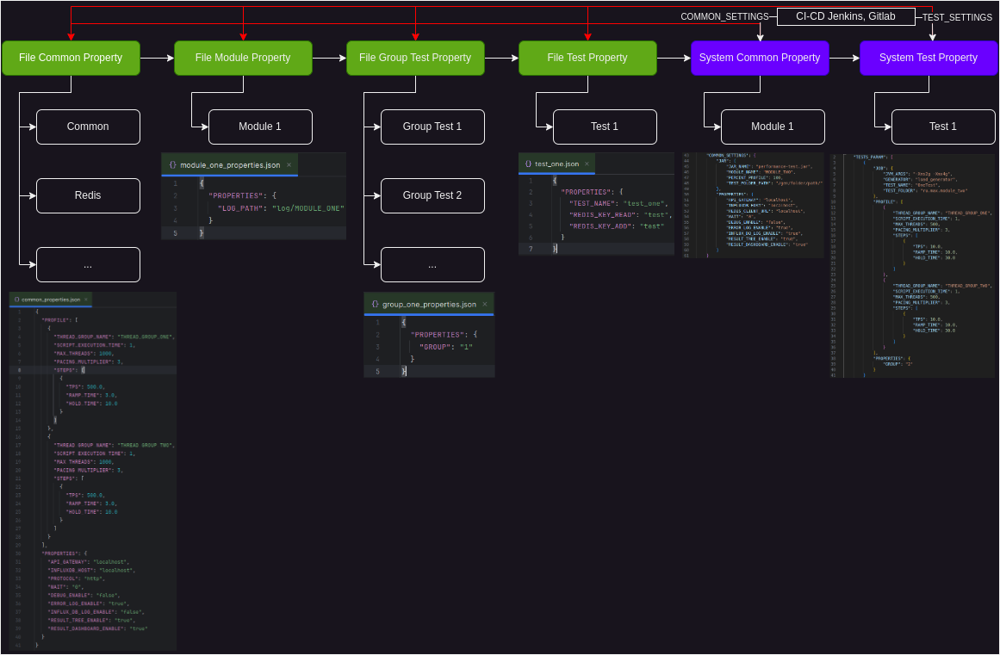
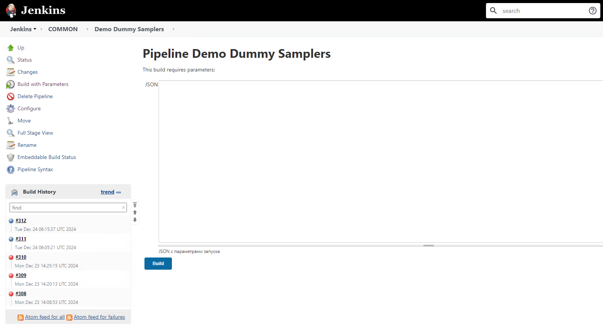

# Load Testing Framework ([JMeter DSL](https://abstracta.github.io/jmeter-java-dsl/))


Пример тестового фреймворка для быстрого старта на JMeter DSL ([Документация](https://abstracta.github.io/jmeter-java-dsl/guide/#simple-http-test-plan)).

## Структура каталогов



### Структура папки common

* **fragments** - Основные компоненты тестового сценария **(которые есть в нескольких модулях)**;
* **helpers** - Вспомогательные классы **(которые есть в нескольких модулях)**;
* **models** - PoJo классы для сериализации и десериализации **(которые есть в нескольких модулях)**;
* **processors** - pre и post процессоры **(которые есть в нескольких модулях)**;
* **thread_groups** - Катушки с параметрами (**Rps Thread Group** и **Thread Group**).

### Структура модуля

* **common** - Общие классы для тестов;
* **fragments** - Основные компоненты тестового сценария;
* **helpers** - Вспомогательные классы;
* **models** - PoJo классы для сериализации и десериализации;
* **processors** - pre и post процессоры.

## Структура тестов

Пример тестового класса:

```java
public class OneTest {
    // Общие properties для тестов
    private CommonTestParameters commonTestParameters;
    // HashMap с профилями нагрузки
    private HashMap<String, Profile> profileParameters;
    // JMeter properties
    private final EmbeddedJmeterEngine embeddedJmeterEngine = new EmbeddedJmeterEngine();

    // Действия перед тестом
    @BeforeTest
    public void init() throws InterruptedException {
        // Метод для синхронизации тестов
        DurationHelper.startTime();

        // Чтение Properties .см диаграмма ниже
        Properties properties = PropertyHelper.readProperties(
                "common/common_properties.json", // Common
                "common/redis.json", // Common
                "module_two/module_two_properties.json", // Module
                "module_two/module_two_groups/group_two_properties.json", // Group
                "module_two/module_two_tests/test_two/test_two.json" // Test
        );

        // Common Parameters
        commonTestParameters = new CommonTestParameters(properties);

        // Profile Parameters
        profileParameters = PropertyHelper.profileToMap(properties);

        // Смена порта Redis Client
        RedisClientFragment.setRedisClientPort(Integer.parseInt(properties.getProperty("REDIS_CLIENT_PORT")));

        // Data Base Parameters, Kafka Parameters ...
        // ...
        // ...
        // ...

        // Пробрасываем properties в jmeter properties
        PropertyHelper.setPropertiesToEngine(embeddedJmeterEngine, properties);
        // Метод для синхронизации тестов по времени (у некоторых тестов могут быть запросы к БД)
        DurationHelper.waitTime(commonTestParameters.getWait());
    }

    // Наименование теста (должно быть как у класса, используется для запуска теста из Jenkins или CLI)
    @Test(testName = "OneTest")
    public void test() throws IOException, InterruptedException, TimeoutException {
        testPlan(
                // 
                getHttpDefaults(),
                // Отключаем кеш
                getCookiesDisable(),
                // Отключаем куки
                getCacheDisable(),
                // Нагрузочная катушка №1
                getRpsThreadGroup("THREAD_GROUP_ONE", profileParameters.get("THREAD_GROUP_ONE"), commonTestParameters.getDebugEnable())
                        .children(
                                // Чтение данных из Redis
                                RedisClientFragment.readList(RedisReadType.FIRST),
                                // Запрос
                                StatusFragment.get()
                        ),

                // Нагрузочная катушка №2
                getRpsThreadGroup("THREAD_GROUP_TWO", profileParameters.get("THREAD_GROUP_TWO"), commonTestParameters.getDebugEnable())
                        .children(
                                // Запрос
                                StatusFragment.get(),
                                // Запись данных в Redis
                                RedisClientFragment.addList(RedisAddType.LAST)
                                        .children(
                                                // Действия перед запросом
                                                jsr223PreProcessor(s -> s.vars.put("redis_client_data", "{ ... }"))
                                        )
                        ),
                // Логирование ошибок
                xmlErrorLog(commonTestParameters.getLogPath(), commonTestParameters.getTestName(), commonTestParameters.getErrorLogEnable()),
                // Отправление метрик в InfluxDB
                influxDbLog(commonTestParameters.getInfluxDbLogEnable()),
                //  Просмотр дерева запросов
                resultTree(commonTestParameters.getResultTreeEnable()),
                // Дашборд для просмотра запросов
                resultDashboard(commonTestParameters.getResultDashboardEnable())
        ).runIn(embeddedJmeterEngine); // Пробрасываем jmeter properties в TestPlan 
    }
}
```

## Работа с Properties в проекте

Подробнее с диаграммой можно ознакомиться: **./diagrams/property.drawio**



Пример использования в коде:

```java
Properties properties = PropertyHelper.readProperties(
        "common/common_properties.json", // Common
        "module_two/module_two_properties.json", // Module
        "module_two/module_two_groups/group_one_properties.json", // Group
        "module_two/module_two_tests/test_one/test_one.json" // Test
);
```

## Правила именования

Наименование переменных:

* Для имен переменных Java использовать **lowerCamelCase**;
* Для названия классов Java использовать **UpperCamelCase**;
* Аббревиатуры также писать CamelCase, например **SqlSelect**, а не **SQLSelect**;
* Для названия каталогов и файлов ресурсов использовать **lower_snake_case**;
* Для имен переменных (vars) JMeterDSL использовать **lower_snake_case**;
* Для имен переменных (props) JMeterDSL использовать **UPPER_SNAKE_CASE**.

Наименование семплеров JMeterDSL:

* Использовать **UPPER_SNAKE_CASE**;
* Названия транзакций начинать с **UC_<USER_CASE>**;
* Названия тестовых фрагментов начинать с **TF_<TEST_FRAGMENT>**;
* Названия HTTP семплеров (не препроцессоров и постпроцессоров) начинать с **UR_<USER_REQUEST>**;
* Названия запросов к DB или Redis начинать с **DB_<DATABASE>**;
* Названия логических компонентов (If/While контроллеры) и препроцессоров/постпроцессоров указывать без префикса;
* Для сообщений лога использовать английский язык. Пример формата - **«Message Something Data»**.

## Сборка .jar файл

Команда для сборки **.jar** архива:

```bash
mvn clean package -DskipTests
```

Путь к **.jar** архиву **./target/performance-test.jar**.

## Запуск теста через Jenkins



Для запуска нагрузочных тестов используется Json:

Пример Json профиля нагрузки:

```json
{
  "TESTS_PARAM": [
    {
      "JOB": {
        "JVM_ARGS": "-Xms2g -Xmx4g",
        "GENERATOR": "load_generator",
        "TEST_NAME": "OneTest",
        "TEST_FOLDER": "ru.max.module_two"
      },
      "PROFILE": [
        {
          "THREAD_GROUP_NAME": "THREAD_GROUP_ONE",
          "SCRIPT_EXECUTION_TIME": 1,
          "MAX_THREADS": 500,
          "PACING_MULTIPLIER": 3,
          "STEPS": [
            {
              "TPS": 10.0,
              "RAMP_TIME": 10.0,
              "HOLD_TIME": 30.0
            }
          ]
        },
        {
          "THREAD_GROUP_NAME": "THREAD_GROUP_TWO",
          "SCRIPT_EXECUTION_TIME": 1,
          "MAX_THREADS": 500,
          "PACING_MULTIPLIER": 3,
          "STEPS": [
            {
              "TPS": 10.0,
              "RAMP_TIME": 10.0,
              "HOLD_TIME": 30.0
            }
          ]
        }
      ],
      "PROPERTIES": {
        "GROUP": "2"
      }
    }
  ],
  "COMMON_SETTINGS": {
    "JAR": {
      "JAR_NAME": "performance-test.jar",
      "MODULE_NAME": "MODULE_TWO",
      "PERCENT_PROFILE": 100,
      "TEST_FOLDER_PATH": "/gen/folder/path/result/test"
    },
    "PROPERTIES": {
      "API_GATEWAY": "localhost",
      "INFLUXDB_HOST": "localhost",
      "REDIS_CLIENT_URL": "localhost",
      "WAIT": "0",
      "DEBUG_ENABLE": "false",
      "ERROR_LOG_ENABLE": "true",
      "INFLUX_DB_LOG_ENABLE": "true",
      "RESULT_TREE_ENABLE": "true",
      "RESULT_DASHBOARD_ENABLE": "true"
    }
  }
}
```

Описание параметров:

* **TESTS_PARAM** - Параметры тестов;
    * **JOB** - Параметры для Java машины;
        * **JVM_ARGS** - Аргументы Java машины (ограничения по ОЗУ);
        * **GENERATOR** - Где будет запускаться тесты;
        * **TEST_NAME** - Наименования тестового класса;
        * **TEST_FOLDER** - Путь до класса в проекте;
    * **PROFILE** - Параметры профиля нагрузки;
        * **Array profile** - Массив профилей для разных катушек;
            * **THREAD_GROUP_NAME** - Наименование катушки;
            * **SCRIPT_EXECUTION_TIME** - Время выполнения запроса (**Thread Group**);
            * **PACING_MULTIPLIER** - Множитель для Pacing (**Thread Group**);
            * **MAX_THREADS** - Максимально количество потоков (**Rps Thread Group**);
            * **STEPS** - Шаги профиля: **TPS** - подаваемая нагрузка, **RAMP_TIME** - выход на заданную интенсивность (
              мин) и **HOLD_TIME** - удержание нагрузки (мин);
    * **PROPERTIES** - Дополнительные параметры для теста.


* **COMMON_SETTINGS** - Параметры для все тестов;
    * **JAR** - Параметры для bash скрипта;
        * **JAR_NAME** - Название jar архива;
        * **MODULE_NAME** - Название модуля (используется для сбора логов);
        * **PERCENT_PROFILE** - Процент профиля;
        * **TEST_FOLDER_PATH** - Папка где находится jar архив;
    * **PROPERTIES** - Дополнительные общие параметры для всех тестов.

Путь к Jenkins Job: **./jenkins/multijob.groovy**

Перед первым запуском pipline нужно заполнить следующие параметры:

* **USERNAME** - имя пользователя;
* **CREDENTIAL** - токен авторизации;
* **GENERATOR_LOGS** - хост генератора где будут храниться логи запусков тестов.

```groovy
environment {
    // Креды пользователя для подключения по ssh и scp
    USERNAME = ''
    CREDENTIAL = ''
    GENERATOR_LOGS = 'localhost'
}
```